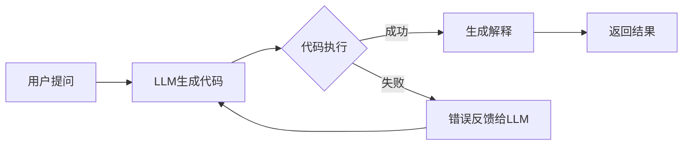

# 智能数据分析助手 🤖

基于大语言模型(LLM)的智能数据分析系统,支持自然语言对话、自动代码生成、错误纠正与结果解释。

## ✨ 核心功能

- 📊 **CSV数据加载**: 支持文件上传或路径指定,自动清理货币/百分比格式
- 💬 **自然语言交互**: 用中文提问,自动生成Python分析代码
- 🔄 **智能纠错**: 代码执行失败时自动重试并修正(最多3次)
- 🧠 **多模型支持**: Gemini、GPT-3.5、Claude、DeepSeek、Qwen3
- 🛡️ **余额保护**: 检测API配额不足并自动切换备用模型
- 📝 **结果解释**: 将数据分析结果转换为易懂的中文说明
- 🖥️ **双界面**: Web界面(Streamlit) + 命令行工具(CLI)

## 🚀 快速开始

### 1️⃣ 环境准备

```bash
# 克隆仓库
git clone https://github.com/YOUR_USERNAME/data_analyzer_app_with_llm_agents.git
cd data_analyzer_app_with_llm_agents

# 安装依赖
pip install -r requirements.txt
```

### 2️⃣ 配置API密钥

创建 `.env` 文件(参考 `.env.example`),至少配置一个模型的密钥:

```env
# 选择一个或多个配置
GOOGLE_API_KEY=your_google_api_key_here
OPENAI_API_KEY=your_openai_api_key_here
ANTHROPIC_API_KEY=your_anthropic_api_key_here
DEEPSEEK_API_KEY=your_deepseek_api_key_here
QWEN_API_KEY=your_qwen_api_key_here
```

### 3️⃣ 启动应用

**Web界面** (推荐):

```bash
streamlit run enhanced_app.py
.\start_web.ps1
```

访问 `http://localhost:8501`

**命令行工具**:

```bash
python cli_analyzer.py --csv your_data.csv --llm qwen3
```

**批量测试**:

```bash
python test_analyzer.py
```

## 📁 项目结构

```
.
├── enhanced_datahelper.py   # 核心分析引擎(代码生成/执行/纠错)
├── enhanced_app.py           # Streamlit Web界面
├── cli_analyzer.py           # 命令行交互工具
├── test_analyzer.py          # 自动化测试脚本
├── test_providers.py         # API密钥测试工具
├── requirements.txt          # Python依赖清单
├── .env.example              # 环境变量模板
├── setup.ps1                 # Windows一键安装脚本
├── start_web.ps1             # Web应用启动脚本
└── run_test.ps1              # 测试运行脚本
```

## 🛠️ 使用示例

### Web界面操作流程

1. **加载数据**: 上传CSV或指定路径,选择LLM模型,点击"加载数据"
2. **提问分析**: 在文本框输入问题(如"分析各类别销售额趋势")
3. **查看结果**: 自动显示生成的代码、执行结果与中文解释
4. **连续对话**: 系统记住历史,可提问关联问题

### 命令行使用

```bash
# 交互模式
python cli_analyzer.py --csv data.csv --llm gemini

# 单次查询
python cli_analyzer.py --csv data.csv --llm qwen3 --question "统计各年份总销售额"
```

### API密钥测试

```bash
# 验证DeepSeek和Qwen密钥可用性
python test_providers.py
```

## 🧪 技术实现

### 核心工作流程



### 关键技术

- **LangChain**: 统一多模型接口(OpenAI/Gemini/Claude/兼容端点)
- **Pandas**: CSV数据处理与分析
- **Streamlit**: 快速构建交互式Web界面
- **动态执行**: 使用 `exec()` 安全执行生成的代码
- **上下文管理**: 保存对话历史,支持连续提问

### 数据安全

- ✅ 代码在隔离的 `local_vars` 环境执行
- ✅ 捕获所有异常,防止系统崩溃
- ✅ API密钥通过 `.env` 管理,不提交到版本控制
- ✅ `.gitignore` 已配置忽略敏感文件

## 🔧 高级功能

### 自动数据清理

系统自动识别并清理:

- 货币格式: `$1,234.56` → `1234.56`
- 百分比: `75%` → `75`
- 空值处理: 自动转换为 `NaN`

### 错误自动纠正

```python
# 第1次尝试失败 → 将错误信息反馈给LLM
# 第2次尝试修正代码
# 最多重试3次,提高成功率
```

### 模型余额保护

```python
# 检测到402/余额不足错误 → 自动切换备用模型
# 优先级: gemini → gpt → claude → deepseek → qwen3
```

## 📝 配置说明

### 模型参数自定义

在 `.env` 中可选配置:

```env
# DeepSeek配置
DEEPSEEK_MODEL=deepseek-chat
DEEPSEEK_API_BASE=https://api.deepseek.com

# Qwen配置
QWEN_MODEL=qwen-plus
QWEN_API_BASE=https://dashscope.aliyuncs.com/compatible-mode/v1
```

### Streamlit配置

已在 `.streamlit/config.toml` 禁用遥测:

```toml
[browser]
gatherUsageStats = false

[server]
headless = true
```

## 🐛 常见问题

**Q: 网页端点击分析无响应?**
A: 确保已加载数据,检查终端是否有异常输出;尝试更换模型。

**Q: 出现402错误?**
A: 当前模型余额不足,在侧边栏切换其他模型;系统会自动尝试备用模型。

**Q: 导入错误 `ModuleNotFoundError`?**
A: 运行 `pip install -r requirements.txt` 安装所有依赖。

**Q: 代码生成为空?**
A: 检查提示词长度(终端会显示DEBUG日志);尝试缩短问题或清空对话历史。

## 📄 许可证

MIT License - 详见 [LICENSE](LICENSE) 文件

## 🤝 贡献

欢迎提交Issue和Pull Request!

## 📧 联系方式

如有问题或建议,请通过GitHub Issues联系。

---

**Star ⭐ 本项目如果对你有帮助!**
