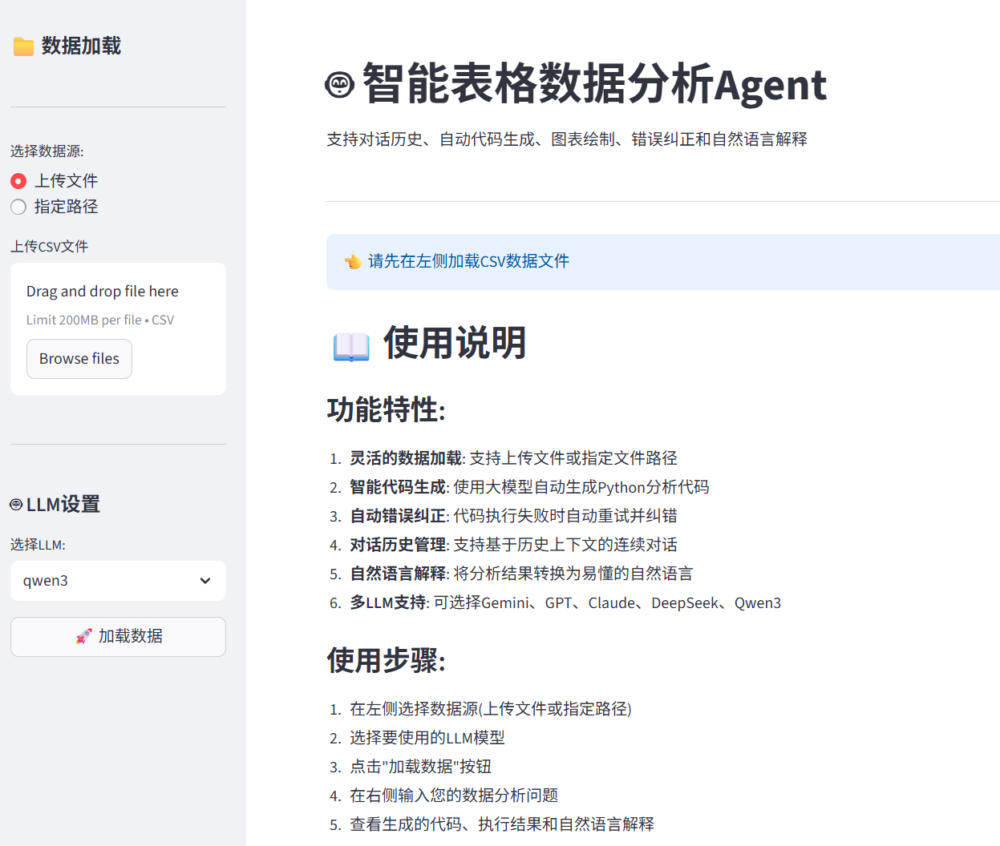
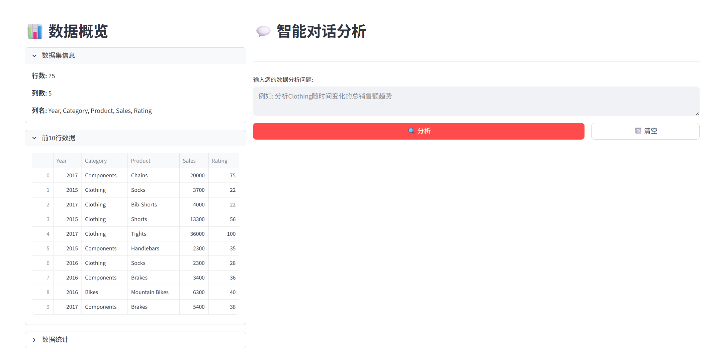

# AI-Powered CSV Data Analyzer

[](https://www.python.org/downloads/)
[](https://streamlit.io/)
[](https://github.com/langchain-ai/langchain)
[](https://opensource.org/licenses/MIT)

[中文文档](README_zh.md) | English

An intelligent data analysis tool powered by LangChain and LLMs that converts natural language questions into Python code, executes analysis, and provides explanations.

## ✨ Features

- **Multi-LLM Support**: Gemini, GPT-4, Claude, DeepSeek, Qwen3
- **Smart Code Generation**: Natural language → Python analysis code
- **Auto Error Correction**: Retry up to 3 times with error feedback
- **Conversation History**: Context-aware multi-turn dialogue
- **Dual Interface**: Web UI (Streamlit) + CLI
- **Chinese Chart Support**: Matplotlib with Chinese fonts
- **Auto Fallback**: Switches models on API quota errors

## 📷 Screenshots

| Home | Analysis |
|------|----------|
|  |  |

## � Quick Start

### Prerequisites

- Python 3.8+
- At least one LLM API key

### Installation

```bash
# Clone repository
git clone https://github.com/yourusername/data_analyzer_app_with_llm_agents.git
cd excel_agent

# Install dependencies
pip install -r requirements.txt

# Configure API keys
cp .env.example .env
# Edit .env and add your API keys
```

### Run Web UI

```bash
streamlit run app.py
```

Visit `http://localhost:8501`

### Run CLI

```bash
python cli_analyzer.py data.csv --llm qwen3
```

## 📖 Usage Examples

**Data Analysis**:

```
Analyze sales trends of Clothing over time
Which years did Components outsell Accessories?
```

**Visualization**:

```
Create a pie chart of sales by Category
Plot Sales vs Rating scatter chart
```

**Statistics**:

```
Calculate average Rating by Category
Find sales outliers
```

## 🏗️ Architecture

```
User Input → LangChain (Unified LLM Interface)
           ↓
      System Prompt + History
           ↓
      LLM Generates Python Code
           ↓
      exec() in Isolated Environment
           ↓
      Success → LLM Explains Result
      Failure → Retry (max 3 times)
```

## 📁 Project Structure

```
├── data_analyzer.py    # Core engine
├── app.py             # Streamlit web UI
├── cli_analyzer.py    # Command-line interface
├── test_analyzer.py   # Test suite
├── requirements.txt   # Dependencies
└── .env.example      # API key template
```

## 🔑 API Keys Configuration

Edit `.env` file (at least one required):

```env
GOOGLE_API_KEY=your_gemini_key
OPENAI_API_KEY=your_openai_key
ANTHROPIC_API_KEY=your_claude_key
DEEPSEEK_API_KEY=your_deepseek_key
QWEN_API_KEY=your_qwen_key
```

## 🛠️ Tech Stack

- **LangChain**: Unified LLM interface
- **Streamlit**: Web UI framework
- **Pandas**: Data manipulation
- **Matplotlib**: Visualization with Chinese support

## 📝 Documentation

- [Implementation Details](IMPLEMENTATION.md)
- [Usage Guide](运行步骤.md)

## 🤝 Contributing

Contributions welcome! Please feel free to submit a Pull Request.

## 📄 License

MIT License - see [LICENSE](LICENSE) file

## 🙏 Acknowledgments

- [LangChain](https://github.com/langchain-ai/langchain)
- [Streamlit](https://streamlit.io/)
- [Pandas](https://pandas.pydata.org/)

---

**⭐ Star this repo if you find it helpful!**
